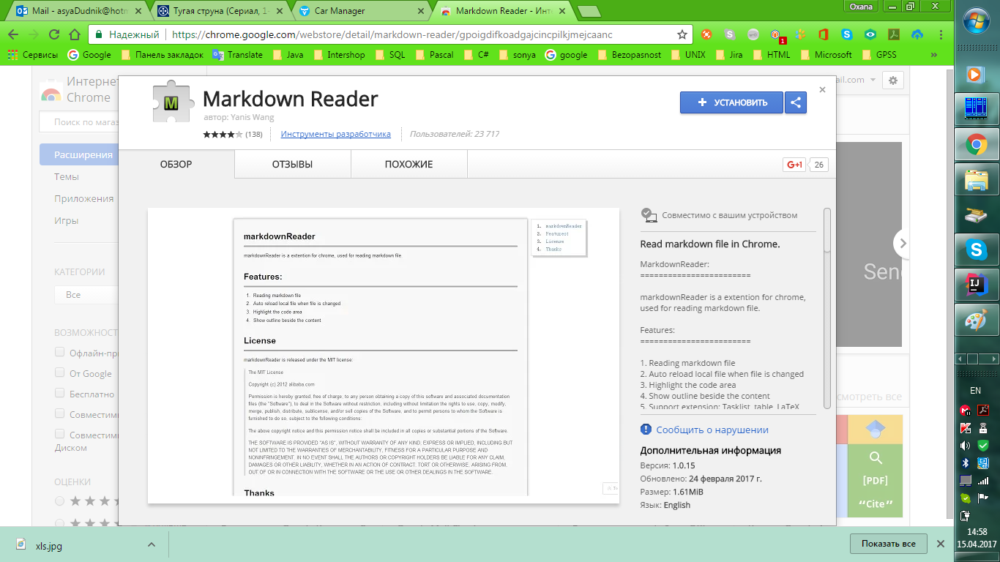
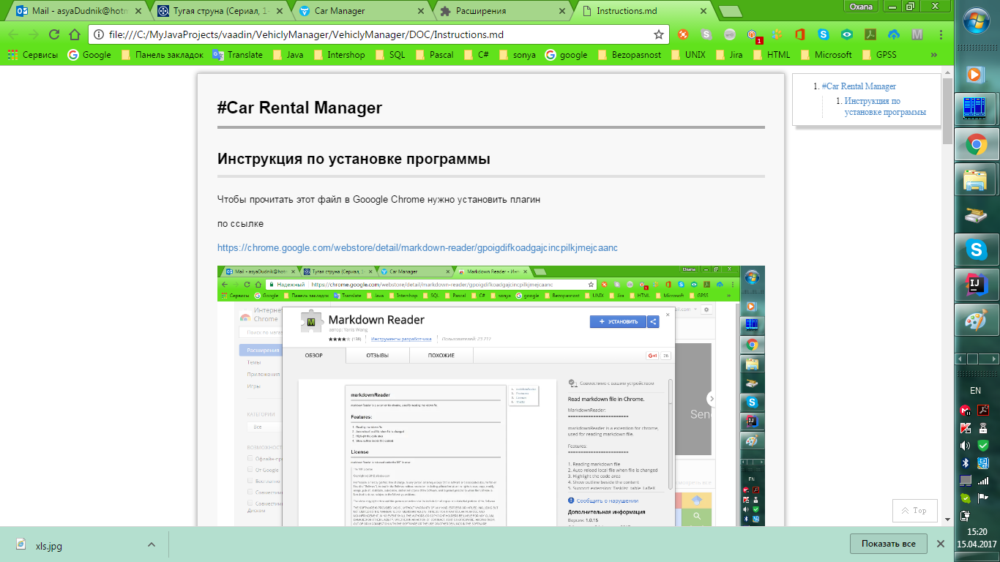
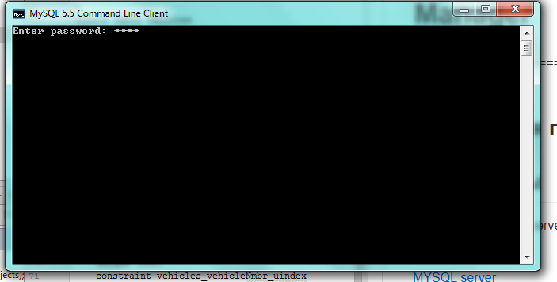
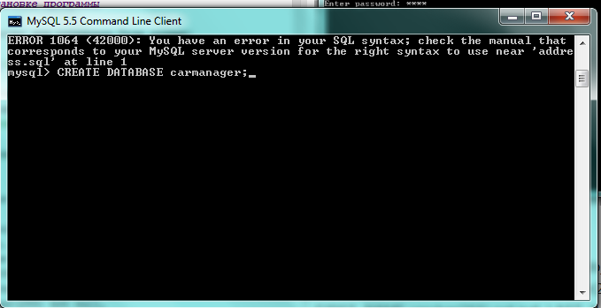
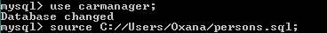
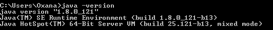
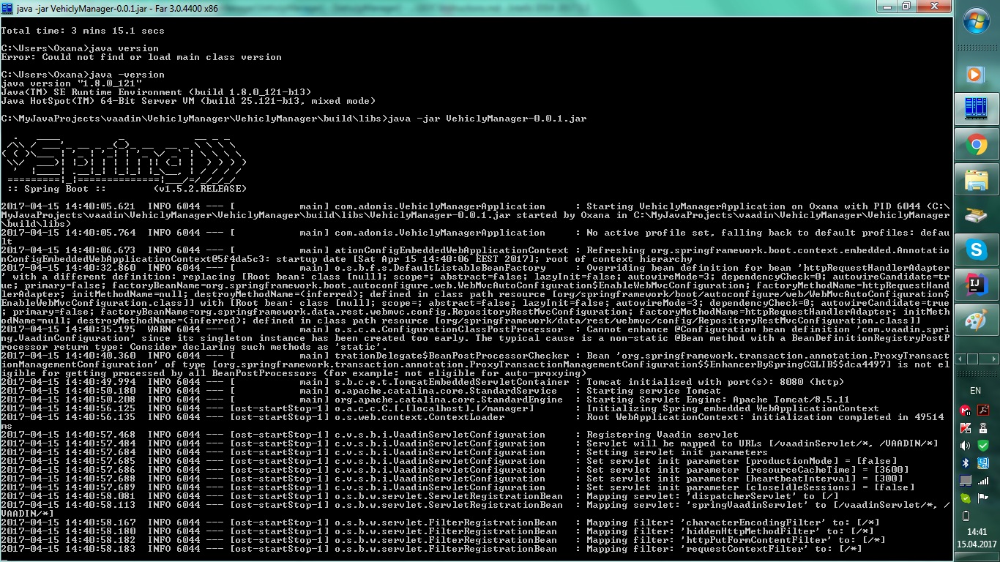
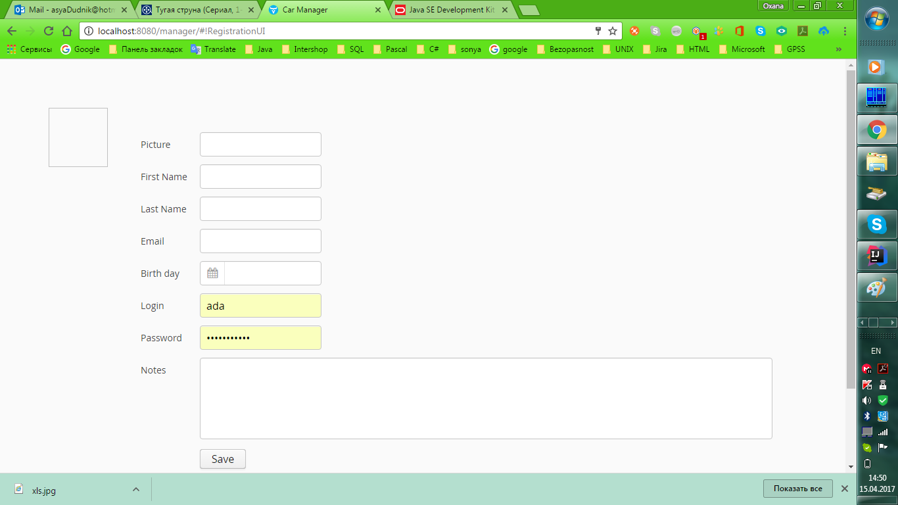
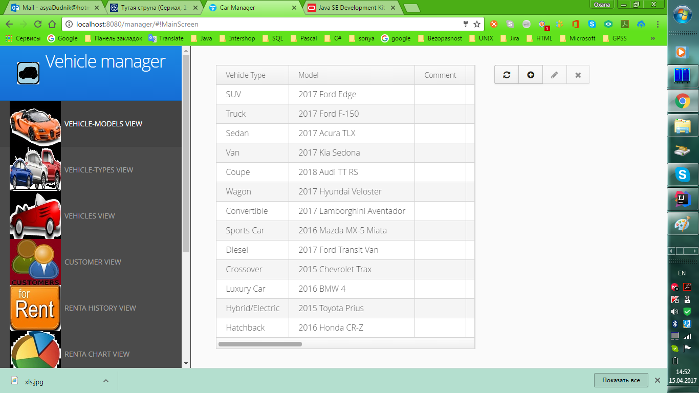

#Car Rental Manager
====================================

##Инструкция по установке программы

Чтобы прочитать этот файл в Gooogle Chrome нужно установить плагин

по ссылке

https://chrome.google.com/webstore/detail/markdown-reader/gpoigdifkoadgajcincpilkjmejcaanc

и просто проводником открывайте файл с расширением md

Instructions.md

1.Скачайте MYSQL server для установки базы данных:

[MYSQL server here](https://dev.mysql.com/downloads/mysql/)

2.Установите, запустите client command line (логин "root" и пароль "root")
и введите команды одна за другой:

= CREATE database carmanager;

= run address.sql

= run persons.sql

=аналогично запустите файлы:
>  models.sql

> types.sql

> vehicles.sql
  
> renta_history.sql

3. Скачайте  и установите jdk

[jdk here](http://www.oracle.com/technetwork/java/javase/downloads/jdk8-downloads-2133151.html)

4. Проверьте что выполняется команда

>java -version

5. Для запуска программы запустите команду

>java -jar VehiclyManager-0.0.1.jar

6. Дождитесь, когда программа запустится, те когда появятся слова
 
 >Started VehiclyManagerApplication
  
7. Наберите в браузере:
    
>localhost:8080/manager/
    

8.Зарегистрируйте логин пароль

9. Войдите под ним и работайте

   
